```python
import pandas as pd
import numpy as np
import matplotlib.pyplot as plt
%matplotlib inline
import warnings
warnings.filterwarnings('ignore')
```


```python
google = pd.read_csv("GOOG.csv", index_col="date")[::-1]
apple = pd.read_csv("AAPL.csv", index_col="date")[::-1]
apple = pd.read_csv("AAPL.csv", index_col="date")[::-1]
amazon = pd.read_csv("AMZN.csv", index_col="date")[::-1]
microsoft = pd.read_csv("MSFT.csv", index_col="date")[::-1]
walmart = pd.read_csv("Walmart.csv", index_col="date")[::-1]

```


```python
walmart.head(10)
```


<div>
<style scoped>
    .dataframe tbody tr th:only-of-type {
        vertical-align: middle;
    }

    .dataframe tbody tr th {
        vertical-align: top;
    }

    .dataframe thead th {
        text-align: right;
    }
</style>
<table border="1" class="dataframe">
  <thead>
    <tr style="text-align: right;">
      <th></th>
      <th>close</th>
      <th>volume</th>
      <th>open</th>
      <th>high</th>
      <th>low</th>
    </tr>
    <tr>
      <th>date</th>
      <th></th>
      <th></th>
      <th></th>
      <th></th>
      <th></th>
    </tr>
  </thead>
  <tbody>
    <tr>
      <th>2014/02/10</th>
      <td>73.76</td>
      <td>6204086.0000</td>
      <td>73.59</td>
      <td>73.760</td>
      <td>72.9600</td>
    </tr>
    <tr>
      <th>2014/02/11</th>
      <td>74.80</td>
      <td>6511228.0000</td>
      <td>73.90</td>
      <td>74.850</td>
      <td>73.6700</td>
    </tr>
    <tr>
      <th>2014/02/12</th>
      <td>74.96</td>
      <td>5339771.0000</td>
      <td>74.22</td>
      <td>75.180</td>
      <td>74.2200</td>
    </tr>
    <tr>
      <th>2014/02/13</th>
      <td>75.36</td>
      <td>5250165.0000</td>
      <td>74.68</td>
      <td>75.490</td>
      <td>74.5600</td>
    </tr>
    <tr>
      <th>2014/02/14</th>
      <td>75.79</td>
      <td>4919940.0000</td>
      <td>75.40</td>
      <td>75.985</td>
      <td>75.1000</td>
    </tr>
    <tr>
      <th>2014/02/18</th>
      <td>75.33</td>
      <td>5993781.0000</td>
      <td>75.49</td>
      <td>75.650</td>
      <td>74.8647</td>
    </tr>
    <tr>
      <th>2014/02/19</th>
      <td>74.85</td>
      <td>8130279.0000</td>
      <td>75.01</td>
      <td>75.320</td>
      <td>74.4100</td>
    </tr>
    <tr>
      <th>2014/02/20</th>
      <td>73.52</td>
      <td>13079110.0000</td>
      <td>73.05</td>
      <td>74.000</td>
      <td>72.8100</td>
    </tr>
    <tr>
      <th>2014/02/21</th>
      <td>73.12</td>
      <td>8971007.0000</td>
      <td>73.19</td>
      <td>73.400</td>
      <td>72.8200</td>
    </tr>
    <tr>
      <th>2014/02/24</th>
      <td>73.35</td>
      <td>7321489.0000</td>
      <td>73.24</td>
      <td>73.815</td>
      <td>73.1400</td>
    </tr>
  </tbody>
</table>
</div>


```python
walmart.drop(walmart.index[-1], inplace=True)
walmart.head(10)
```


<div>
<style scoped>
    .dataframe tbody tr th:only-of-type {
        vertical-align: middle;
    }

    .dataframe tbody tr th {
        vertical-align: top;
    }

    .dataframe thead th {
        text-align: right;
    }
</style>
<table border="1" class="dataframe">
  <thead>
    <tr style="text-align: right;">
      <th></th>
      <th>close</th>
      <th>volume</th>
      <th>open</th>
      <th>high</th>
      <th>low</th>
    </tr>
    <tr>
      <th>date</th>
      <th></th>
      <th></th>
      <th></th>
      <th></th>
      <th></th>
    </tr>
  </thead>
  <tbody>
    <tr>
      <th>2014/02/10</th>
      <td>73.76</td>
      <td>6204086.0000</td>
      <td>73.59</td>
      <td>73.760</td>
      <td>72.9600</td>
    </tr>
    <tr>
      <th>2014/02/11</th>
      <td>74.80</td>
      <td>6511228.0000</td>
      <td>73.90</td>
      <td>74.850</td>
      <td>73.6700</td>
    </tr>
    <tr>
      <th>2014/02/12</th>
      <td>74.96</td>
      <td>5339771.0000</td>
      <td>74.22</td>
      <td>75.180</td>
      <td>74.2200</td>
    </tr>
    <tr>
      <th>2014/02/13</th>
      <td>75.36</td>
      <td>5250165.0000</td>
      <td>74.68</td>
      <td>75.490</td>
      <td>74.5600</td>
    </tr>
    <tr>
      <th>2014/02/14</th>
      <td>75.79</td>
      <td>4919940.0000</td>
      <td>75.40</td>
      <td>75.985</td>
      <td>75.1000</td>
    </tr>
    <tr>
      <th>2014/02/18</th>
      <td>75.33</td>
      <td>5993781.0000</td>
      <td>75.49</td>
      <td>75.650</td>
      <td>74.8647</td>
    </tr>
    <tr>
      <th>2014/02/19</th>
      <td>74.85</td>
      <td>8130279.0000</td>
      <td>75.01</td>
      <td>75.320</td>
      <td>74.4100</td>
    </tr>
    <tr>
      <th>2014/02/20</th>
      <td>73.52</td>
      <td>13079110.0000</td>
      <td>73.05</td>
      <td>74.000</td>
      <td>72.8100</td>
    </tr>
    <tr>
      <th>2014/02/21</th>
      <td>73.12</td>
      <td>8971007.0000</td>
      <td>73.19</td>
      <td>73.400</td>
      <td>72.8200</td>
    </tr>
    <tr>
      <th>2014/02/24</th>
      <td>73.35</td>
      <td>7321489.0000</td>
      <td>73.24</td>
      <td>73.815</td>
      <td>73.1400</td>
    </tr>
  </tbody>
</table>
</div>


# 5 years stock price calculation #


```python
google['close'].plot(figsize=(10,6), label= "Google", title="5Years stock price")
apple['close'].plot(label="Apple")
amazon['close'].plot(label="Amazon")
walmart['close'].plot(label="Walmart")
microsoft["close"].plot(label="Microsoft")
plt.legend()
```


    <matplotlib.legend.Legend at 0x1195ffe80>


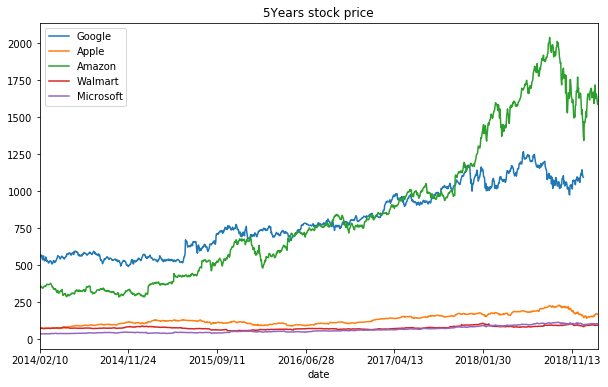


## 5 years trade volume ##


```python
walmart['volume'][0] # volume needs to be changed from string into integer or float for the chart
```


    '6204086.0000'


```python
#List comprehension:
walmart['volume'] = [float(each) for each in walmart['volume']]
```


```python
google['volume'].plot(figsize=(10,6), label= "Google", title="5Years of trade volume")
apple['volume'].plot(label="Apple")
amazon['volume'].plot(label="Amazon")
walmart['volume'].plot(label="Walmart")
microsoft["volume"].plot(label="Microsoft")
plt.legend()
```


    <matplotlib.legend.Legend at 0x1197ab9b0>


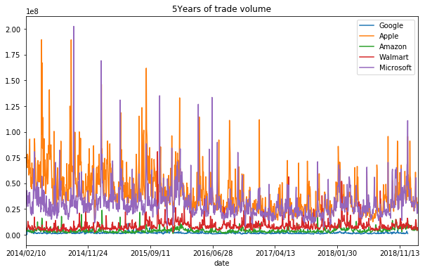


```python
microsoft['volume'].argmax()
```


    '2014/09/19'


## Total trade values in 5 years ##


```python
google['total trade'] = google['open']*google['volume']
microsoft['total trade'] = microsoft['open']*microsoft['volume']
apple['total trade'] = apple['open']*apple['volume']
amazon['total trade'] = amazon['open']*amazon['volume']
walmart['total trade'] = walmart['open']*walmart['volume']
```


```python
google['total trade'].plot(figsize=(10,6), label= "Google", title="5Years of total trade")
apple['total trade'].plot(label="Apple")
amazon['total trade'].plot(label="Amazon")
walmart['total trade'].plot(label="Walmart")
microsoft['total trade'].plot(label="Microsoft")
plt.legend()
```


    <matplotlib.legend.Legend at 0x118d94668>


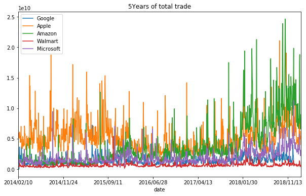


## Google ##


```python
#calculating the moving average(MA) of the last 50 days,200 days
google['MA50'] = google['close'].rolling(50).mean()
google['MA200'] = google['close'].rolling(200).mean()
google[['MA50','MA200','close']].plot(figsize=(10,6))
```


    <matplotlib.axes._subplots.AxesSubplot at 0x1190a7d30>


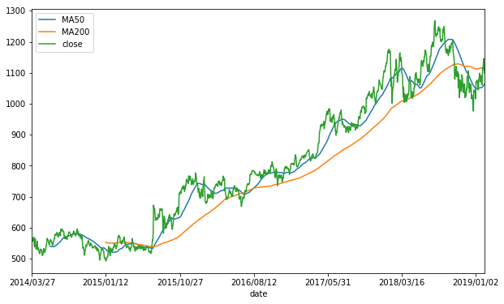


## Amazon ##


```python
amazon['MA50'] = amazon['close'].rolling(50).mean()
amazon['MA200'] = amazon['close'].rolling(200).mean()
amazon[['MA50','MA200','close']].plot(figsize=(10,6))
```


    <matplotlib.axes._subplots.AxesSubplot at 0x11966f128>


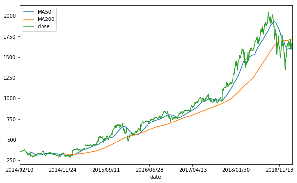


## APPLE ##


```python
apple['MA50'] = apple['close'].rolling(50).mean()
apple['MA200'] = apple['close'].rolling(200).mean()
apple[['MA50','MA200','close']].plot(figsize=(10,6))
```


    <matplotlib.axes._subplots.AxesSubplot at 0x1189c1a58>


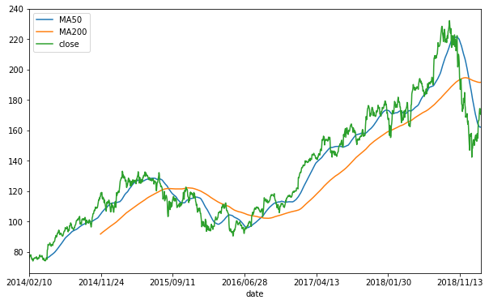


## Microsoft ##


```python
microsoft['MA50'] = microsoft['close'].rolling(50).mean()
microsoft['MA200'] = microsoft['close'].rolling(200).mean()
microsoft[['MA50','MA200','close']].plot(figsize=(10,6))
```


    <matplotlib.axes._subplots.AxesSubplot at 0x109c8bf60>


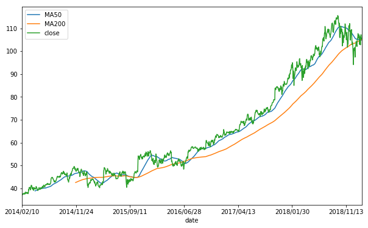


## Walmart ##


```python
walmart['MA50'] = walmart['close'].rolling(50).mean()
walmart['MA200'] = walmart['close'].rolling(200).mean()
walmart[['MA50','MA200','close']].plot(figsize=(10,6))
```


    <matplotlib.axes._subplots.AxesSubplot at 0x11902bfd0>


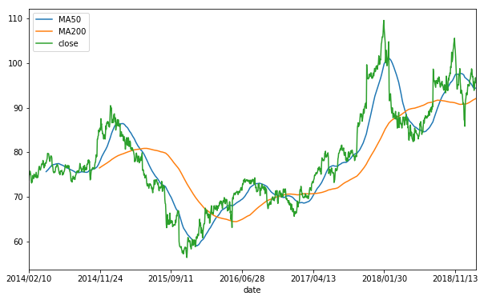


## Correlation ##


```python
from pandas.plotting import scatter_matrix
```


```python
all_company = pd.concat([google['close'],
                        amazon['close'],
                        apple['close'],
                        microsoft['close'],
                        walmart['close']], axis =1)
all_company.columns = ['Google','Amazon','Apple','Microsoft','Walmart']
```


```python
all_company.head()
```


<div>
<style scoped>
    .dataframe tbody tr th:only-of-type {
        vertical-align: middle;
    }

    .dataframe tbody tr th {
        vertical-align: top;
    }

    .dataframe thead th {
        text-align: right;
    }
</style>
<table border="1" class="dataframe">
  <thead>
    <tr style="text-align: right;">
      <th></th>
      <th>Google</th>
      <th>Amazon</th>
      <th>Apple</th>
      <th>Microsoft</th>
      <th>Walmart</th>
    </tr>
  </thead>
  <tbody>
    <tr>
      <th>2014/02/10</th>
      <td>NaN</td>
      <td>360.87</td>
      <td>75.5700</td>
      <td>36.800</td>
      <td>73.76</td>
    </tr>
    <tr>
      <th>2014/02/11</th>
      <td>NaN</td>
      <td>361.79</td>
      <td>76.5657</td>
      <td>37.175</td>
      <td>74.80</td>
    </tr>
    <tr>
      <th>2014/02/12</th>
      <td>NaN</td>
      <td>349.25</td>
      <td>76.5600</td>
      <td>37.470</td>
      <td>74.96</td>
    </tr>
    <tr>
      <th>2014/02/13</th>
      <td>NaN</td>
      <td>357.20</td>
      <td>77.7757</td>
      <td>37.610</td>
      <td>75.36</td>
    </tr>
    <tr>
      <th>2014/02/14</th>
      <td>NaN</td>
      <td>357.35</td>
      <td>77.7128</td>
      <td>37.620</td>
      <td>75.79</td>
    </tr>
  </tbody>
</table>
</div>


```python
scatter_matrix(all_company, alpha=0.5, figsize = (10,10), hist_kwds = {"bins": 50})
plt.show()
```


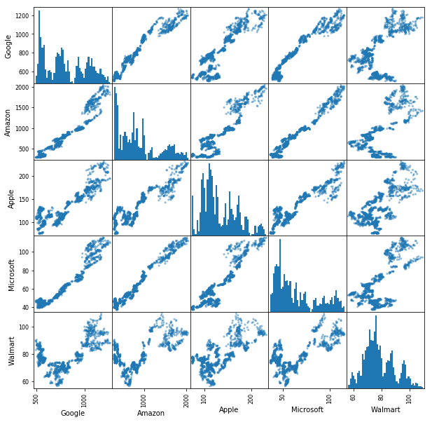


## Candle stick ##

## Google ##


```python
from mpl_finance import candlestick_ochl
from matplotlib.dates import DateFormatter, date2num, WeekdayLocator, DayLocator, MONDAY
from datetime import datetime
```


```python
index0= google.index[0]
datetime.strptime(index0, '%Y/%m/%d')
```


    datetime.datetime(2014, 3, 27, 0, 0)


```python
google_30days = google.iloc[-30:-1]
google_30days['date_axis']=[datetime.strptime(each, '%Y/%m/%d') for each in google_30days.index]
```


```python
google_30days["date_axis"]=[date2num(each)for each in google_30days["date_axis"]]
google_30days.head()
```


<div>
<style scoped>
    .dataframe tbody tr th:only-of-type {
        vertical-align: middle;
    }

    .dataframe tbody tr th {
        vertical-align: top;
    }

    .dataframe thead th {
        text-align: right;
    }
</style>
<table border="1" class="dataframe">
  <thead>
    <tr style="text-align: right;">
      <th></th>
      <th>close</th>
      <th>volume</th>
      <th>open</th>
      <th>high</th>
      <th>low</th>
      <th>total trade</th>
      <th>MA50</th>
      <th>MA200</th>
      <th>date_axis</th>
    </tr>
    <tr>
      <th>date</th>
      <th></th>
      <th></th>
      <th></th>
      <th></th>
      <th></th>
      <th></th>
      <th></th>
      <th></th>
      <th></th>
    </tr>
  </thead>
  <tbody>
    <tr>
      <th>2018/12/27</th>
      <td>1043.88</td>
      <td>2102069.0</td>
      <td>1017.15</td>
      <td>1043.89</td>
      <td>997.00</td>
      <td>2.138119e+09</td>
      <td>1055.8954</td>
      <td>1114.45965</td>
      <td>737055.0</td>
    </tr>
    <tr>
      <th>2018/12/28</th>
      <td>1037.08</td>
      <td>1399218.0</td>
      <td>1049.62</td>
      <td>1055.56</td>
      <td>1033.10</td>
      <td>1.468647e+09</td>
      <td>1054.2114</td>
      <td>1113.89760</td>
      <td>737056.0</td>
    </tr>
    <tr>
      <th>2018/12/31</th>
      <td>1035.61</td>
      <td>1492541.0</td>
      <td>1050.96</td>
      <td>1052.70</td>
      <td>1023.59</td>
      <td>1.568601e+09</td>
      <td>1052.6098</td>
      <td>1113.32775</td>
      <td>737059.0</td>
    </tr>
    <tr>
      <th>2019/01/02</th>
      <td>1045.85</td>
      <td>1516681.0</td>
      <td>1016.57</td>
      <td>1052.32</td>
      <td>1015.71</td>
      <td>1.541812e+09</td>
      <td>1051.7674</td>
      <td>1112.87835</td>
      <td>737061.0</td>
    </tr>
    <tr>
      <th>2019/01/03</th>
      <td>1016.06</td>
      <td>1829379.0</td>
      <td>1041.00</td>
      <td>1056.98</td>
      <td>1014.07</td>
      <td>1.904384e+09</td>
      <td>1050.1594</td>
      <td>1112.45955</td>
      <td>737062.0</td>
    </tr>
  </tbody>
</table>
</div>


```python
google_30days_values = [tuple(vals) for vals in google_30days[['date_axis','open','close','high','low']].values]
```


```python
fig, ax = plt.subplots(figsize = (16,8))

mondays = WeekdayLocator(MONDAY)
alldays = DayLocator()
weekFormatter = DateFormatter('%b %d')
dayFormatter = DateFormatter('%d')

fig.subplots_adjust(bottom = 0.2)
ax.xaxis.set_major_locator(mondays)
ax.xaxis.set_minor_locator(alldays)
ax.xaxis.set_major_formatter(weekFormatter)

candlestick_ochl(ax,google_30days_values, width= 0.6, colorup='g', colordown='r')
plt.show()
```


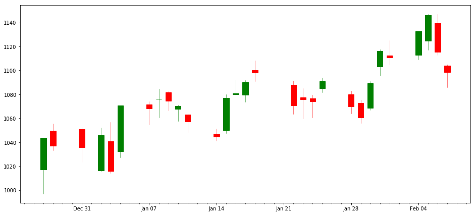


## Apple ##


```python
index0= apple.index[0]
datetime.strptime(index0, '%Y/%m/%d')
```


    datetime.datetime(2014, 2, 10, 0, 0)


```python
apple_30days = apple.iloc[-30:-1]
apple_30days['date_axis']=[datetime.strptime(each, '%Y/%m/%d') for each in apple_30days.index]
```


```python
apple_30days["date_axis"]=[date2num(each)for each in apple_30days["date_axis"]]
apple_30days.head()
```


<div>
<style scoped>
    .dataframe tbody tr th:only-of-type {
        vertical-align: middle;
    }

    .dataframe tbody tr th {
        vertical-align: top;
    }

    .dataframe thead th {
        text-align: right;
    }
</style>
<table border="1" class="dataframe">
  <thead>
    <tr style="text-align: right;">
      <th></th>
      <th>close</th>
      <th>volume</th>
      <th>open</th>
      <th>high</th>
      <th>low</th>
      <th>total trade</th>
      <th>MA50</th>
      <th>MA200</th>
      <th>date_axis</th>
    </tr>
    <tr>
      <th>date</th>
      <th></th>
      <th></th>
      <th></th>
      <th></th>
      <th></th>
      <th></th>
      <th></th>
      <th></th>
      <th></th>
    </tr>
  </thead>
  <tbody>
    <tr>
      <th>2018/12/27</th>
      <td>156.15</td>
      <td>51608850.0</td>
      <td>155.84</td>
      <td>156.77</td>
      <td>150.07</td>
      <td>8.042723e+09</td>
      <td>188.8136</td>
      <td>193.50425</td>
      <td>737055.0</td>
    </tr>
    <tr>
      <th>2018/12/28</th>
      <td>156.23</td>
      <td>41740600.0</td>
      <td>157.50</td>
      <td>158.52</td>
      <td>154.55</td>
      <td>6.574144e+09</td>
      <td>187.4952</td>
      <td>193.39320</td>
      <td>737056.0</td>
    </tr>
    <tr>
      <th>2018/12/31</th>
      <td>157.74</td>
      <td>34499390.0</td>
      <td>158.53</td>
      <td>159.36</td>
      <td>156.48</td>
      <td>5.469188e+09</td>
      <td>186.2262</td>
      <td>193.28865</td>
      <td>737059.0</td>
    </tr>
    <tr>
      <th>2019/01/02</th>
      <td>157.92</td>
      <td>35637070.0</td>
      <td>154.89</td>
      <td>158.85</td>
      <td>154.23</td>
      <td>5.519826e+09</td>
      <td>185.0642</td>
      <td>193.18815</td>
      <td>737061.0</td>
    </tr>
    <tr>
      <th>2019/01/03</th>
      <td>142.19</td>
      <td>91106840.0</td>
      <td>143.98</td>
      <td>145.72</td>
      <td>142.00</td>
      <td>1.311756e+10</td>
      <td>183.5218</td>
      <td>193.02260</td>
      <td>737062.0</td>
    </tr>
  </tbody>
</table>
</div>


```python
apple_30days_values = [tuple(vals) for vals in apple_30days[['date_axis','open','close','high','low']].values]
```


```python
fig, ax = plt.subplots(figsize = (16,8))

mondays = WeekdayLocator(MONDAY)
alldays = DayLocator()
weekFormatter = DateFormatter('%b %d')
dayFormatter = DateFormatter('%d')

fig.subplots_adjust(bottom = 0.2)
ax.xaxis.set_major_locator(mondays)
ax.xaxis.set_minor_locator(alldays)
ax.xaxis.set_major_formatter(weekFormatter)

candlestick_ochl(ax,apple_30days_values, width= 0.6, colorup='g', colordown='r')
plt.show()
```


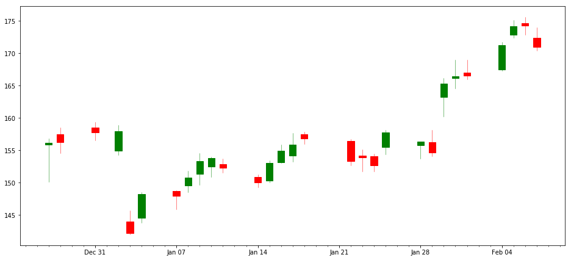


## Amazon ##


```python
index0= amazon.index[0]
datetime.strptime(index0, '%Y/%m/%d')
```


    datetime.datetime(2014, 2, 10, 0, 0)


```python
amazon_30days = amazon.iloc[-30:-1]
amazon_30days['date_axis']=[datetime.strptime(each, '%Y/%m/%d') for each in amazon_30days.index]

amazon_30days["date_axis"]=[date2num(each)for each in amazon_30days["date_axis"]]
amazon_30days.head()
```


<div>
<style scoped>
    .dataframe tbody tr th:only-of-type {
        vertical-align: middle;
    }

    .dataframe tbody tr th {
        vertical-align: top;
    }

    .dataframe thead th {
        text-align: right;
    }
</style>
<table border="1" class="dataframe">
  <thead>
    <tr style="text-align: right;">
      <th></th>
      <th>close</th>
      <th>volume</th>
      <th>open</th>
      <th>high</th>
      <th>low</th>
      <th>total trade</th>
      <th>MA50</th>
      <th>MA200</th>
      <th>date_axis</th>
    </tr>
    <tr>
      <th>date</th>
      <th></th>
      <th></th>
      <th></th>
      <th></th>
      <th></th>
      <th></th>
      <th></th>
      <th></th>
      <th></th>
    </tr>
  </thead>
  <tbody>
    <tr>
      <th>2018/12/27</th>
      <td>1461.64</td>
      <td>9631228.0</td>
      <td>1454.20</td>
      <td>1469.00</td>
      <td>1390.31</td>
      <td>1.400573e+10</td>
      <td>1625.7104</td>
      <td>1701.409375</td>
      <td>737055.0</td>
    </tr>
    <tr>
      <th>2018/12/28</th>
      <td>1478.02</td>
      <td>8822598.0</td>
      <td>1473.35</td>
      <td>1513.47</td>
      <td>1449.00</td>
      <td>1.299877e+10</td>
      <td>1618.8716</td>
      <td>1700.844475</td>
      <td>737056.0</td>
    </tr>
    <tr>
      <th>2018/12/31</th>
      <td>1501.97</td>
      <td>6941598.0</td>
      <td>1510.80</td>
      <td>1520.76</td>
      <td>1487.00</td>
      <td>1.048737e+10</td>
      <td>1612.2764</td>
      <td>1700.442725</td>
      <td>737059.0</td>
    </tr>
    <tr>
      <th>2019/01/02</th>
      <td>1539.13</td>
      <td>7871967.0</td>
      <td>1465.20</td>
      <td>1553.36</td>
      <td>1460.93</td>
      <td>1.153401e+10</td>
      <td>1607.6446</td>
      <td>1700.279975</td>
      <td>737061.0</td>
    </tr>
    <tr>
      <th>2019/01/03</th>
      <td>1500.28</td>
      <td>6934218.0</td>
      <td>1520.01</td>
      <td>1538.00</td>
      <td>1497.11</td>
      <td>1.054008e+10</td>
      <td>1602.3696</td>
      <td>1700.056725</td>
      <td>737062.0</td>
    </tr>
  </tbody>
</table>
</div>


```python
amazon_30days_values = [tuple(vals) for vals in amazon_30days[['date_axis','open','close','high','low']].values]

fig, ax = plt.subplots(figsize = (16,8))

mondays = WeekdayLocator(MONDAY)
alldays = DayLocator()
weekFormatter = DateFormatter('%b %d')
dayFormatter = DateFormatter('%d')

fig.subplots_adjust(bottom = 0.2)
ax.xaxis.set_major_locator(mondays)
ax.xaxis.set_minor_locator(alldays)
ax.xaxis.set_major_formatter(weekFormatter)

candlestick_ochl(ax,amazon_30days_values, width= 0.6, colorup='g', colordown='r')
plt.show()
```


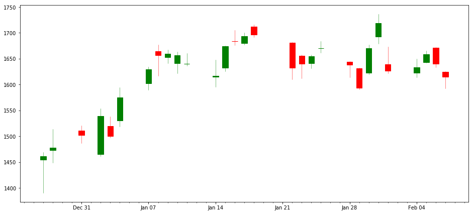


## Microsoft ##


```python
index0= microsoft.index[0]
datetime.strptime(index0, '%Y/%m/%d')

microsoft_30days = microsoft.iloc[-30:-1]
microsoft_30days['date_axis']=[datetime.strptime(each, '%Y/%m/%d') for each in microsoft_30days.index]

microsoft_30days["date_axis"]=[date2num(each)for each in microsoft_30days["date_axis"]]
microsoft_30days.head()
```


<div>
<style scoped>
    .dataframe tbody tr th:only-of-type {
        vertical-align: middle;
    }

    .dataframe tbody tr th {
        vertical-align: top;
    }

    .dataframe thead th {
        text-align: right;
    }
</style>
<table border="1" class="dataframe">
  <thead>
    <tr style="text-align: right;">
      <th></th>
      <th>close</th>
      <th>volume</th>
      <th>open</th>
      <th>high</th>
      <th>low</th>
      <th>total trade</th>
      <th>MA50</th>
      <th>MA200</th>
      <th>date_axis</th>
    </tr>
    <tr>
      <th>date</th>
      <th></th>
      <th></th>
      <th></th>
      <th></th>
      <th></th>
      <th></th>
      <th></th>
      <th></th>
      <th></th>
    </tr>
  </thead>
  <tbody>
    <tr>
      <th>2018/12/27</th>
      <td>101.18</td>
      <td>49162950.0</td>
      <td>99.30</td>
      <td>101.190</td>
      <td>96.40</td>
      <td>4.881881e+09</td>
      <td>106.4670</td>
      <td>103.40565</td>
      <td>737055.0</td>
    </tr>
    <tr>
      <th>2018/12/28</th>
      <td>100.39</td>
      <td>38160810.0</td>
      <td>102.09</td>
      <td>102.410</td>
      <td>99.52</td>
      <td>3.895837e+09</td>
      <td>106.2548</td>
      <td>103.43835</td>
      <td>737056.0</td>
    </tr>
    <tr>
      <th>2018/12/31</th>
      <td>101.57</td>
      <td>33161320.0</td>
      <td>101.29</td>
      <td>102.400</td>
      <td>100.44</td>
      <td>3.358910e+09</td>
      <td>106.0720</td>
      <td>103.47530</td>
      <td>737059.0</td>
    </tr>
    <tr>
      <th>2019/01/02</th>
      <td>101.12</td>
      <td>35145360.0</td>
      <td>99.55</td>
      <td>101.750</td>
      <td>98.94</td>
      <td>3.498721e+09</td>
      <td>105.9244</td>
      <td>103.50790</td>
      <td>737061.0</td>
    </tr>
    <tr>
      <th>2019/01/03</th>
      <td>97.40</td>
      <td>42111650.0</td>
      <td>100.10</td>
      <td>100.185</td>
      <td>97.20</td>
      <td>4.215376e+09</td>
      <td>105.6992</td>
      <td>103.53045</td>
      <td>737062.0</td>
    </tr>
  </tbody>
</table>
</div>


```python
microsoft_30days_values = [tuple(vals) for vals in microsoft_30days[['date_axis','open','close','high','low']].values]

fig, ax = plt.subplots(figsize = (16,8))

mondays = WeekdayLocator(MONDAY)
alldays = DayLocator()
weekFormatter = DateFormatter('%b %d')
dayFormatter = DateFormatter('%d')

fig.subplots_adjust(bottom = 0.2)
ax.xaxis.set_major_locator(mondays)
ax.xaxis.set_minor_locator(alldays)
ax.xaxis.set_major_formatter(weekFormatter)

candlestick_ochl(ax,microsoft_30days_values, width= 0.6, colorup='g', colordown='r')
plt.show()
```


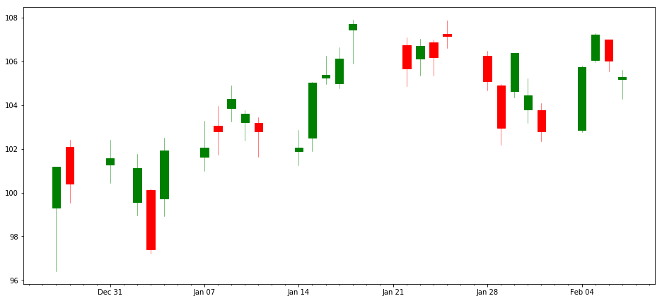


## Walmart ##


```python
index0= walmart.index[0]
datetime.strptime(index0, '%Y/%m/%d')
```


```python
walmart_30days = walmart.iloc[-30:-1]
walmart_30days['date_axis']=[datetime.strptime(each, '%Y/%m/%d') for each in walmart_30days.index]

walmart_30days["date_axis"]=[date2num(each)for each in walmart_30days["date_axis"]]
walmart_30days.head()
```


<div>
<style scoped>
    .dataframe tbody tr th:only-of-type {
        vertical-align: middle;
    }

    .dataframe tbody tr th {
        vertical-align: top;
    }

    .dataframe thead th {
        text-align: right;
    }
</style>
<table border="1" class="dataframe">
  <thead>
    <tr style="text-align: right;">
      <th></th>
      <th>close</th>
      <th>volume</th>
      <th>open</th>
      <th>high</th>
      <th>low</th>
      <th>total trade</th>
      <th>MA50</th>
      <th>MA200</th>
      <th>date_axis</th>
    </tr>
    <tr>
      <th>date</th>
      <th></th>
      <th></th>
      <th></th>
      <th></th>
      <th></th>
      <th></th>
      <th></th>
      <th></th>
      <th></th>
    </tr>
  </thead>
  <tbody>
    <tr>
      <th>2018/12/27</th>
      <td>91.59</td>
      <td>9404904.0</td>
      <td>89.75</td>
      <td>91.61</td>
      <td>88.440</td>
      <td>8.440901e+08</td>
      <td>96.6592</td>
      <td>90.81970</td>
      <td>737055.0</td>
    </tr>
    <tr>
      <th>2018/12/28</th>
      <td>92.13</td>
      <td>9872995.0</td>
      <td>92.07</td>
      <td>93.47</td>
      <td>91.645</td>
      <td>9.090066e+08</td>
      <td>96.5856</td>
      <td>90.84200</td>
      <td>737056.0</td>
    </tr>
    <tr>
      <th>2018/12/31</th>
      <td>93.15</td>
      <td>7005838.0</td>
      <td>92.67</td>
      <td>93.39</td>
      <td>92.250</td>
      <td>6.492310e+08</td>
      <td>96.5174</td>
      <td>90.87020</td>
      <td>737059.0</td>
    </tr>
    <tr>
      <th>2019/01/02</th>
      <td>93.34</td>
      <td>8148594.0</td>
      <td>91.64</td>
      <td>93.65</td>
      <td>91.640</td>
      <td>7.467372e+08</td>
      <td>96.4608</td>
      <td>90.89105</td>
      <td>737061.0</td>
    </tr>
    <tr>
      <th>2019/01/03</th>
      <td>92.86</td>
      <td>8320025.0</td>
      <td>93.21</td>
      <td>94.71</td>
      <td>92.700</td>
      <td>7.755095e+08</td>
      <td>96.3750</td>
      <td>90.91810</td>
      <td>737062.0</td>
    </tr>
  </tbody>
</table>
</div>


```python
walmart_30days_values = [tuple(vals) for vals in walmart_30days[['date_axis','open','close','high','low']].values]

fig, ax = plt.subplots(figsize = (16,8))

mondays = WeekdayLocator(MONDAY)
alldays = DayLocator()
weekFormatter = DateFormatter('%b %d')
dayFormatter = DateFormatter('%d')

fig.subplots_adjust(bottom = 0.2)
ax.xaxis.set_major_locator(mondays)
ax.xaxis.set_minor_locator(alldays)
ax.xaxis.set_major_formatter(weekFormatter)

candlestick_ochl(ax,walmart_30days_values, width= 0.6, colorup='g', colordown='r')
plt.show()
```


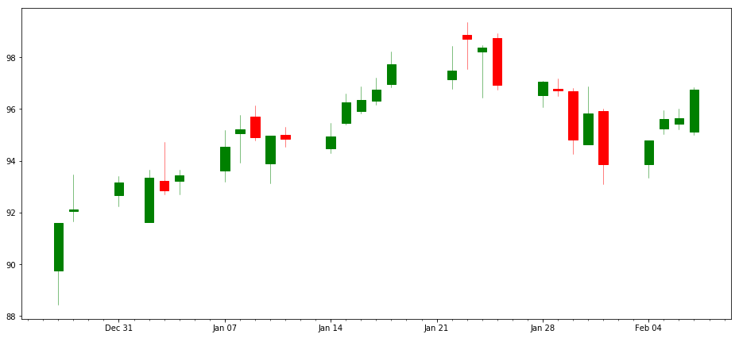


```python

```
